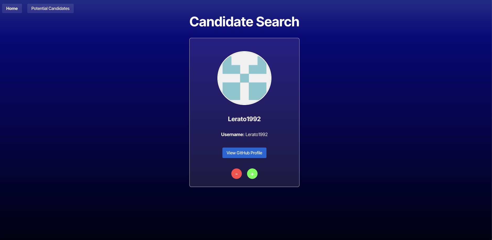
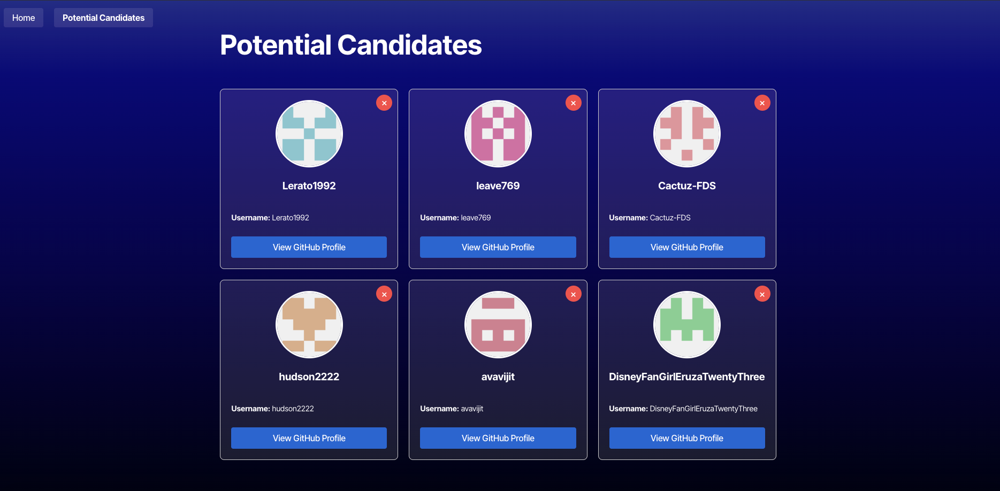

# Git Candidate Database
This is an app to help employers find their dream candidates!

## Render Link to app:
https://git-candidates-database.onrender.com/

## How It's Made:
Using React, Javescript, HTML and CSS inplementation in React.
Using Render to deploy and VS Code to build


**Tech used:**  React, Node, Love and affection


## Setup

1. Clone the repository
```bash
git clone <repository-url>
cd Git-Candidates-Database
```

2. Install dependencies
```bash
npm install
```

3. Set up environment variables
   - Copy `.env.example` to `.env.local`:
     ```bash
     cp .env.example .env.local
     ```
   - Generate a GitHub Personal Access Token:
     1. Go to [GitHub Settings > Developer Settings > Personal Access Tokens > Fine-grained tokens](https://github.com/settings/tokens)
     2. Click "Generate new token"
     3. Set the following:
        - Token name: "Git-Candidates-Database"
        - Expiration: Choose your preferred duration
        - Repository access: "All repositories" or select specific ones
        - Permissions:
          - Account permissions > User: Read-only
          - Account permissions > Email addresses: Read-only
     4. Click "Generate token"
     5. Copy the generated token
   - Edit `.env.local` and replace `your_github_token_here` with your actual token

4. Start the development server
```bash
npm run dev
```

## Features

- Search through GitHub users
- View detailed user information
- Save potential candidates
- View saved candidates list

## Environment Variables

- `VITE_GITHUB_TOKEN`: GitHub Personal Access Token (required)
  - Required permissions: `read:user`, `user:email`
  - Generate at: https://github.com/settings/tokens


**Github:** <https://github.com/eoreilly0906>

**Email:** edwardoreilly0906@gmail.com

## Notes on code
Starter code provided

https://react.dev/reference/react/useState

https://docs.github.com/en/rest/users/users

https://coding-boot-camp.github.io/full-stack/render/render-deployment-guide

https://docs.render.com/configure-environment-variables

https://www.Google.com

https://coding-boot-camp.github.io/full-stack/render/render-deployment-guide

## Screenshots of app

### Candidate Search Page


### Saved Candidates Page


